# Seleksi Labpro 2 — Identity & Authorization Provider

Implementasi **Identity & Authorization Provider terpusat** untuk Seleksi 2 Laboratorium Pemrograman 2026. Sistem menyediakan Single Sign-On (SSO), authorization berbasis group policy, OAuth2-style Authorization Code Flow dengan PKCE, central/local session, asynchronous session revocation, serta seluruh bonus B01–B04.

## Identitas

- **Nama:** Niko Samuel Simanjuntak
- **NIM:** 13524029

## Menjalankan Sistem

### 1. Siapkan environment

Salin `.env.example` menjadi `.env`:

```powershell
Copy-Item .env.example .env
```

Untuk Linux/macOS:

```bash
cp .env.example .env
```

Sebelum menjalankan sistem, ubah nilai berikut pada `.env`:

| Variable | Keterangan |
|---|---|
| `PRIMARY_DB_PASSWORD` | Password Primary PostgreSQL |
| `APP_A_DB_PASSWORD` | Password PostgreSQL App A |
| `APP_B_DB_PASSWORD` | Password PostgreSQL App B |
| `RABBITMQ_PASSWORD` | Password RabbitMQ |
| `APP_A_CLIENT_SECRET` | Client secret untuk App A |
| `APP_B_CLIENT_SECRET` | Client secret untuk App B |
| `SEED_USER_PASSWORD` | Password untuk seluruh akun user yang dibuat oleh seed |
| `MFA_ENCRYPTION_KEY_BASE64` | Key acak 32-byte dalam Base64 untuk mengenkripsi TOTP secret |
| `APP_A_INTERNAL_LOGOUT_SECRET` | HMAC secret untuk `/internal/logout` App A, minimal 32 karakter |
| `APP_B_INTERNAL_LOGOUT_SECRET` | HMAC secret untuk `/internal/logout` App B, minimal 32 karakter |

Konfigurasi lain dapat menggunakan nilai default pada `.env.example` apabila sistem dijalankan melalui Docker Compose dengan port localhost yang telah disediakan.

Generate `MFA_ENCRYPTION_KEY_BASE64` menggunakan:

```powershell
docker run --rm node:24-bookworm-slim node -e "console.log(require('crypto').randomBytes(32).toString('base64'))"
```

Generate secret acak menggunakan command berikut:

```powershell
docker run --rm node:24-bookworm-slim node -e "console.log(require('crypto').randomBytes(32).toString('hex'))"
```

Jalankan command tersebut kembali untuk setiap secret yang diperlukan agar `APP_A_CLIENT_SECRET`, `APP_B_CLIENT_SECRET`, `APP_A_INTERNAL_LOGOUT_SECRET`, dan `APP_B_INTERNAL_LOGOUT_SECRET` menggunakan nilai yang berbeda.

`PRIMARY_DATABASE_URL`, `APP_A_DATABASE_URL`, `APP_B_DATABASE_URL`, dan `RABBITMQ_URL` pada `.env.example` digunakan ketika service dijalankan langsung dari host. Ketika menggunakan Docker Compose, connection URL dikonstruksi ulang menggunakan credential dan nama service Docker.

### 2. Build dan jalankan infrastructure

```powershell
docker compose build
docker compose up -d primary-db app-a-db app-b-db rabbitmq prometheus
```

### 3. Jalankan migration

```powershell
docker compose run --rm auth-server pnpm db:migrate
docker compose run --rm app-a pnpm db:migrate
docker compose run --rm app-b pnpm db:migrate
```

### 4. Jalankan seed

```powershell
docker compose run --rm auth-server pnpm db:seed
```

Seed menyediakan user, group, policy, serta konfigurasi App A dan App B. Akun administrator yang disediakan adalah `admin@example.com`, dengan password sesuai nilai `SEED_USER_PASSWORD` pada `.env`.

### 5. Jalankan seluruh stack

```powershell
docker compose up -d
```

Untuk menghentikan seluruh stack:

```powershell
docker compose down
```

### URL Komponen

| Komponen | URL / Port |
|---|---|
| Auth Provider | http://localhost:3000 |
| Control Panel Admin | http://localhost:3001 |
| App A | http://localhost:4000 |
| App B | http://localhost:4001 |
| Sync Worker Health | http://localhost:5000/health/live |
| Event Publisher Health | http://localhost:5001/health/live |
| RabbitMQ Management | http://localhost:15672 |
| Prometheus | http://localhost:9090 |
| Primary PostgreSQL | localhost:5432 |
| App A PostgreSQL | localhost:5433 |
| App B PostgreSQL | localhost:5434 |

## Arsitektur dan Alur

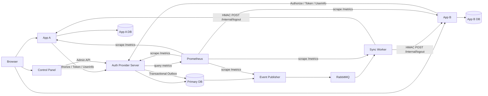

### Authentication dan SSO

1. App A/App B membuat `state` dan PKCE `code_verifier`, lalu mengarahkan browser ke `/authorize`.
2. Auth Provider memvalidasi central session, user, application, exact-match `redirect_uri`, serta group policy.
3. Authorization code sekali pakai dikirim melalui browser ke callback aplikasi.
4. Backend aplikasi menukar code melalui `/token` menggunakan client credential dan PKCE verifier.
5. Aplikasi mengambil profil melalui `/userinfo` lalu membuat **local session** sendiri.
6. Central session Auth Provider dapat digunakan kembali untuk SSO ke aplikasi lain tanpa login password ulang.

### Revocation dan Event Processing

Perubahan keamanan seperti SSO logout, password change, atau perubahan akses melakukan revocation dan penulisan outbox dalam transaksi database yang sama. Event Publisher memublikasikan delivery ke RabbitMQ menggunakan publisher confirmation. Sync Worker memproses message secara at-least-once, melakukan retry dengan backoff `5s → 15s → 30s`, dan memindahkan delivery yang gagal permanen/kehabisan retry ke DLQ. App A dan App B memproses `/internal/logout` secara idempotent berdasarkan `eventId`.

## Keputusan Teknis

### Opaque Access Token

Access token menggunakan **opaque random token**. Database hanya menyimpan SHA-256 hash token beserta user, application/audience, central session, expiry, dan status revocation.

Konsekuensi:
- revocation dan audience binding dapat diperiksa secara langsung di server;
- raw token tidak perlu disimpan di database;
- validasi membutuhkan lookup ke Auth Provider/Primary DB sehingga tidak self-contained seperti JWT.

### RabbitMQ dan Transactional Outbox

RabbitMQ dipilih karena mendukung acknowledgement, publisher confirmation, retry queue, dead-letter queue, serta pola at-least-once yang sesuai untuk propagasi revocation. Transactional Outbox memastikan perubahan security state dan pembuatan event tersimpan atomik sebelum event dipublikasikan.

### Service-to-Service Authentication

`POST /internal/logout` menggunakan HMAC-SHA256 dengan secret berbeda untuk setiap relying application. Sync Worker mengirim:

- `X-Event-Id`
- `X-Timestamp`
- `X-Signature`

Signature dihitung dari canonical payload `timestamp.payload`. App memverifikasi event ID, freshness timestamp (maksimal ±5 menit), dan signature menggunakan timing-safe comparison.

### Soft Delete vs Hard Delete

Pendekatan yang digunakan bersifat hybrid:
- **User dan application:** tidak dihapus; lifecycle memakai status `active/inactive`.
- **Central session dan access token:** dipertahankan sebagai histori dan ditandai `revoked`/`revoked_at`.
- **Authorization code:** dipertahankan dengan `used_at` dan expiry.
- **Membership, policy, dan redirect URI:** hard delete karena merupakan relasi/konfigurasi yang dapat dibuat ulang.
- **Audit log dan event/outbox:** dipertahankan untuk auditability dan reliability.

## Technology Stack

| Area | Technology | Versi |
|---|---|---|
| Runtime | Node.js | 24 |
| Package manager | pnpm | 10.28.1 |
| Language | TypeScript | 7.0.2 (workspace), 6.0.2 (Control Panel) |
| Backend | Fastify | 5.11.3 |
| Validation | Zod | 4.4.3 |
| Frontend | React | 19.2.8 |
| Frontend tooling | Vite | 8.2.0 |
| Database | PostgreSQL | 18 |
| ORM | Drizzle ORM | 0.45.2 |
| Migration | Drizzle Kit | 0.31.10 |
| Password hashing | Argon2 | 0.45.1 (Argon2id) |
| Message broker | RabbitMQ | 4.x (`rabbitmq:4-management`) |
| AMQP client | amqplib | 2.0.1 |
| Metrics | Prometheus | 3.7.3 |
| Metrics client | prom-client | 15.1.3 |
| TOTP | OTPAuth | 9.5.1 |
| QR generation | qrcode | 1.5.4 |
| Testing | Vitest | 4.1.10 |
| Containerization | Docker + Docker Compose | Compose v2 compatible |

## Daftar Endpoint

### Auth Provider — Authentication, Account, OAuth, dan MFA

| Method | Endpoint | Fungsi |
|---|---|---|
| GET | `/` | Entry point Auth Provider |
| GET / POST | `/login` | Login password |
| GET | `/session` | Inspect central session |
| POST | `/logout/sso` | SSO logout |
| GET | `/account` | Account page |
| POST | `/account/logout/sso` | SSO logout dari account page |
| GET / POST | `/account/password` | Ganti password sendiri |
| GET | `/authorize` | Authorization Code + PKCE |
| POST | `/token` | Exchange authorization code menjadi access token |
| GET | `/userinfo` | Informasi user berdasarkan access token |
| GET / POST | `/login/mfa` | MFA challenge saat login |
| GET | `/security/mfa` | MFA management page |
| POST | `/security/mfa/start` | Mulai TOTP enrollment |
| POST | `/security/mfa/confirm` | Konfirmasi TOTP enrollment |
| GET / POST | `/security/mfa/disable` | Nonaktifkan MFA |
| GET | `/security/mfa/replace` | Halaman penggantian authenticator |
| POST | `/security/mfa/replace/start` | Mulai penggantian authenticator |
| POST | `/security/mfa/replace/confirm` | Konfirmasi penggantian authenticator |
| GET | `/health/live` | Liveness probe |
| GET | `/health/ready` | Readiness probe |
| GET | `/metrics` | Prometheus metrics |

### Auth Provider — Admin API

| Method | Endpoint |
|---|---|
| GET | `/admin/me` |
| GET / POST | `/admin/users` |
| GET / PATCH | `/admin/users/:userId` |
| PATCH | `/admin/users/:userId/status` |
| PUT | `/admin/users/:userId/password` |
| GET | `/admin/users/:userId/mfa` |
| POST | `/admin/users/:userId/mfa/reset` |
| GET / POST | `/admin/users/:userId/groups` |
| DELETE | `/admin/users/:userId/groups/:groupId` |
| GET / POST | `/admin/groups` |
| GET / PATCH | `/admin/groups/:groupId` |
| GET | `/admin/groups/:groupId/users` |
| GET / POST | `/admin/applications` |
| GET / PATCH | `/admin/applications/:applicationId` |
| PATCH | `/admin/applications/:applicationId/status` |
| GET / POST | `/admin/applications/:applicationId/redirect-uris` |
| DELETE | `/admin/applications/:applicationId/redirect-uris/:redirectUriId` |
| GET / POST | `/admin/applications/:applicationId/policies` |
| DELETE | `/admin/applications/:applicationId/policies/:policyId` |
| GET | `/admin/observability` |

### App A dan App B

Kedua relying application menyediakan endpoint dengan kontrak yang sama pada port masing-masing.

| Method | Endpoint | Fungsi |
|---|---|---|
| GET | `/` | Home / local session page |
| GET | `/login` | Mulai authorization flow |
| GET | `/callback` | OAuth callback |
| POST | `/logout` | Local logout |
| POST | `/internal/logout` | Back-channel revocation dari Sync Worker |
| GET | `/health/live` | Liveness probe |
| GET | `/health/ready` | Readiness probe |
| GET | `/metrics` | Prometheus metrics |

### Sync Worker dan Event Publisher

Keduanya menyediakan:

| Method | Endpoint |
|---|---|
| GET | `/health/live` |
| GET | `/health/ready` |
| GET | `/metrics` |

## Bonus

### B01 — TOTP MFA + Recovery Codes

TOTP MFA terintegrasi ke login utama. User dengan MFA aktif hanya mendapatkan central session setelah faktor kedua berhasil. Pending MFA state short-lived dan terpisah dari central session. TOTP secret dienkripsi menggunakan AES-256-GCM, sedangkan recovery code disimpan sebagai hash dan bersifat sekali pakai. Enrollment, login verification, disable, replacement, dan admin reset tersedia dari UI/API serta dicatat pada audit log.

### B02 — Observability

Setiap service mengekspos `/metrics` menggunakan `prom-client`, kemudian Prometheus melakukan scraping setiap 2 detik. Dashboard Observability berada di Control Panel dan menampilkan status service, request rate, error rate, P95 latency, RabbitMQ queue depth/consumer, serta statistik Sync Worker dengan auto-refresh 2 detik.

### B03 — Liveness & Readiness Probe

`/health/live` hanya membuktikan process masih responsif, sedangkan `/health/ready` memeriksa dependency operasional. Auth Provider memeriksa Primary DB dan RabbitMQ. Ketika dependency gagal, liveness tetap `200` sementara readiness menjadi `503`, dan dapat kembali ready setelah dependency pulih tanpa restart Auth Server.

### B04 — Graceful Shutdown

Auth Server, Event Publisher, dan Sync Worker menangani `SIGTERM`/`SIGINT` dengan shutdown timeout 10 detik dan Docker grace period 15 detik. HTTP listener dihentikan secara teratur, publisher menyelesaikan current publish cycle, dan worker menghentikan consumer baru lalu menunggu in-flight delivery. Message yang belum aman di-ACK dapat di-redeliver oleh RabbitMQ dan tetap aman karena idempotency.

## Screenshot

### 1. Control Panel — User List, Search, Status Filter, and Pagination

<p align="center">
  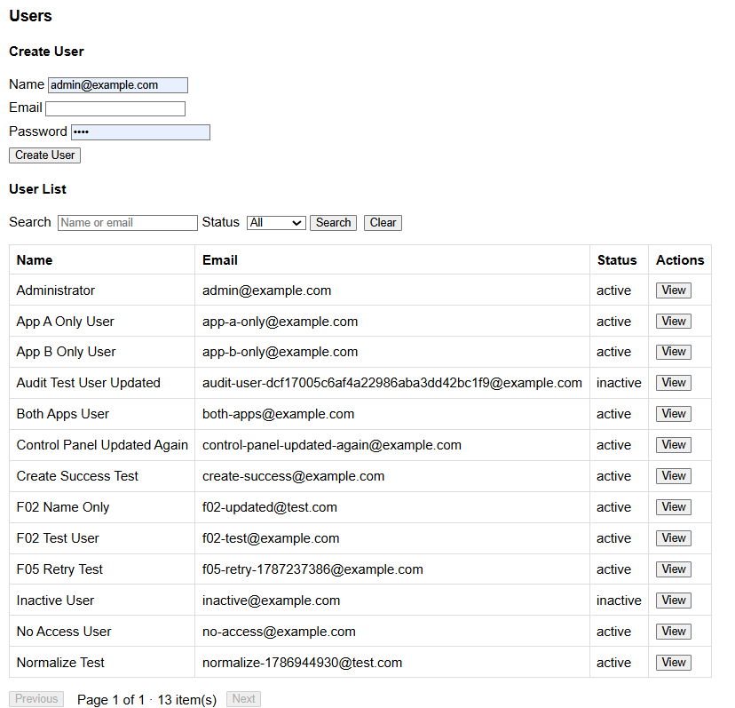
</p>

### 2. Control Panel — User Detail, Status, Password, MFA, and Memberships

<p align="center">
  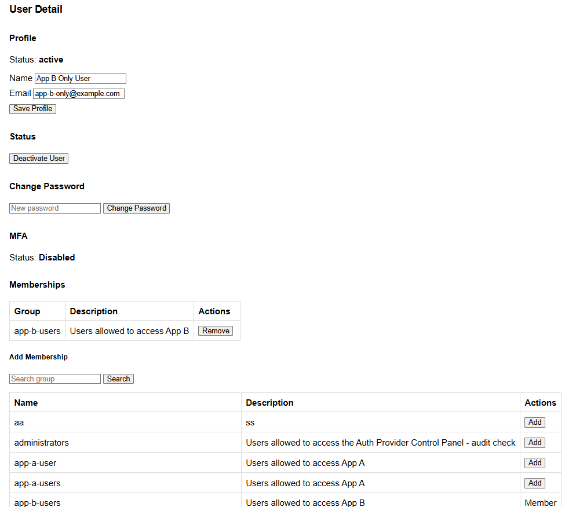
</p>

### 3. Control Panel — Group Detail and Member Management

<p align="center">
  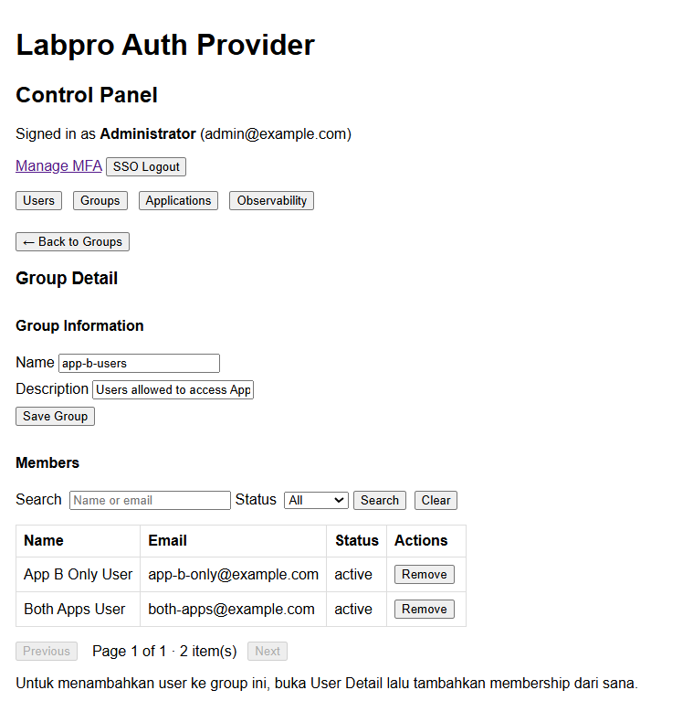
</p>

### 4. Control Panel — Application Configuration, Redirect URIs, and Access Policies

<p align="center">
  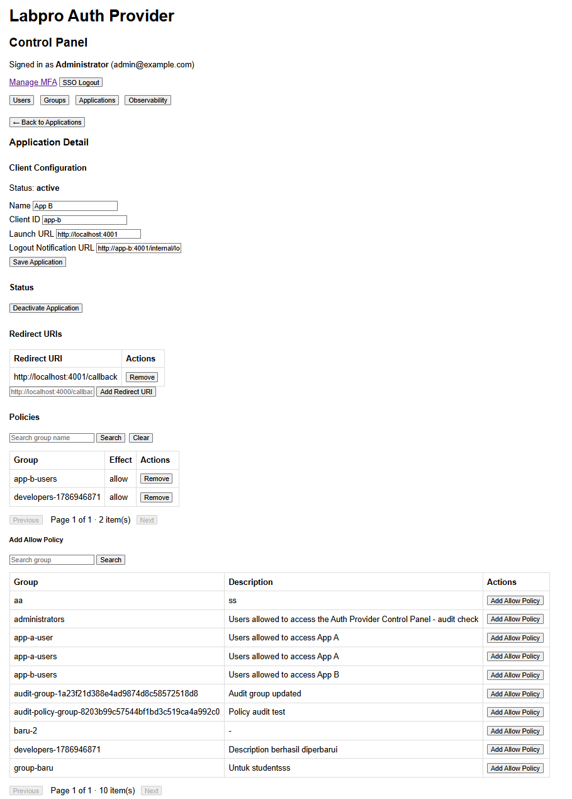
</p>

### 5. SSO — App A Authenticated Session, Processed Events, and Activity Log

<p align="center">
  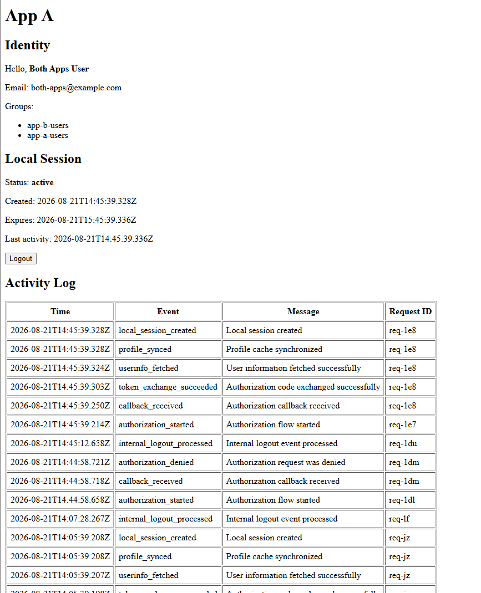
</p>

### 6. SSO — App B Authenticated Session, Processed Events, and Activity Log

<p align="center">
  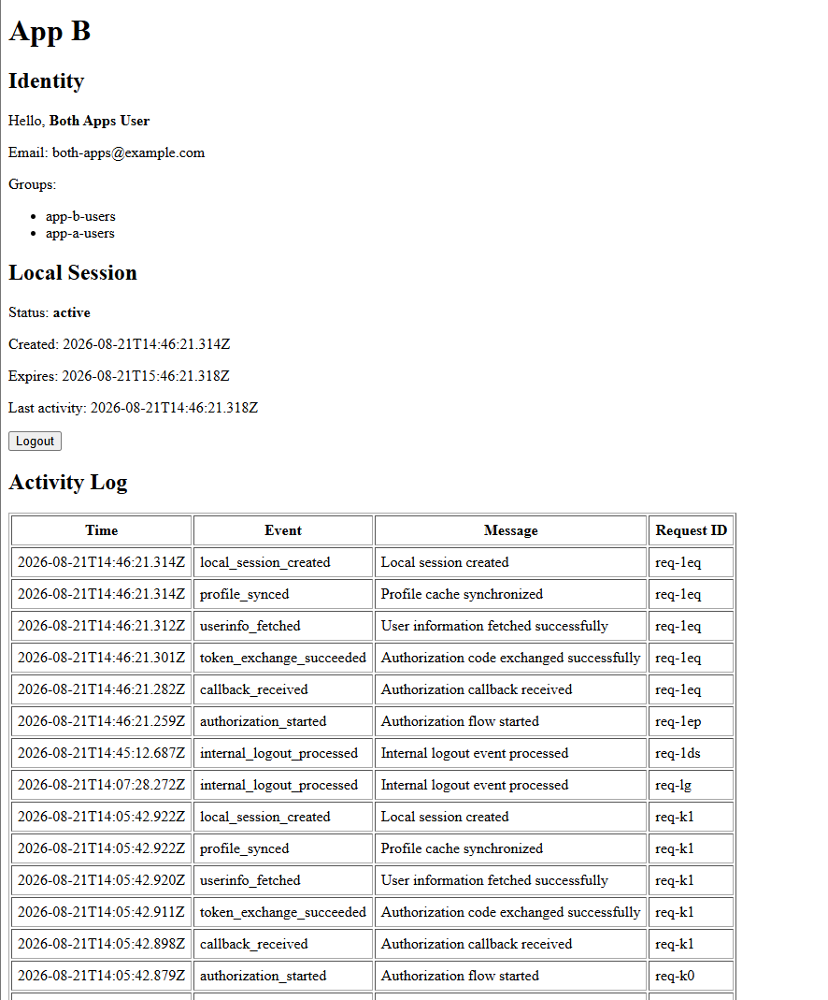
</p>

### 7. F05 — RabbitMQ Main, Retry, and Dead-Letter Queues

<p align="center">
  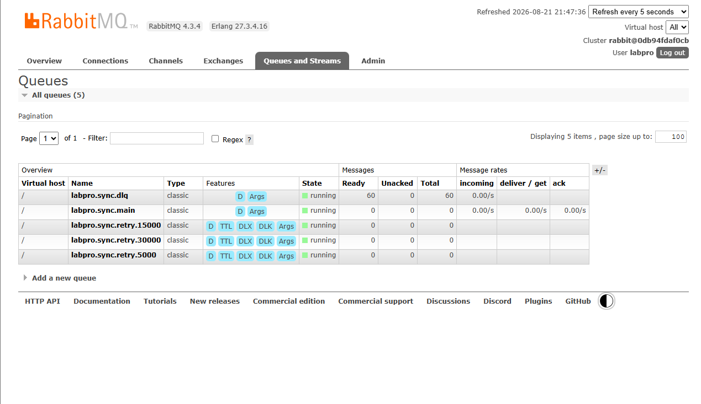
</p>

### 8. B01 — TOTP MFA Enrollment and Verification

<p align="center">
  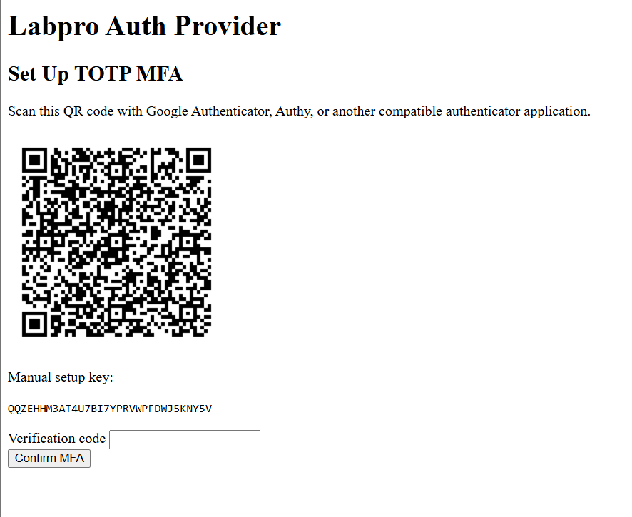
</p>

### 9. B01 — MFA Login Challenge with TOTP and Recovery Code

<p align="center">
  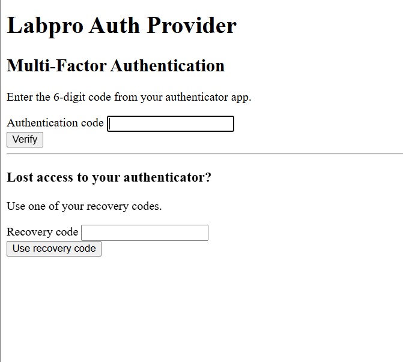
</p>

### 10. B02 — Observability Dashboard: Service, HTTP, Queue, and Worker Metrics

<p align="center">
  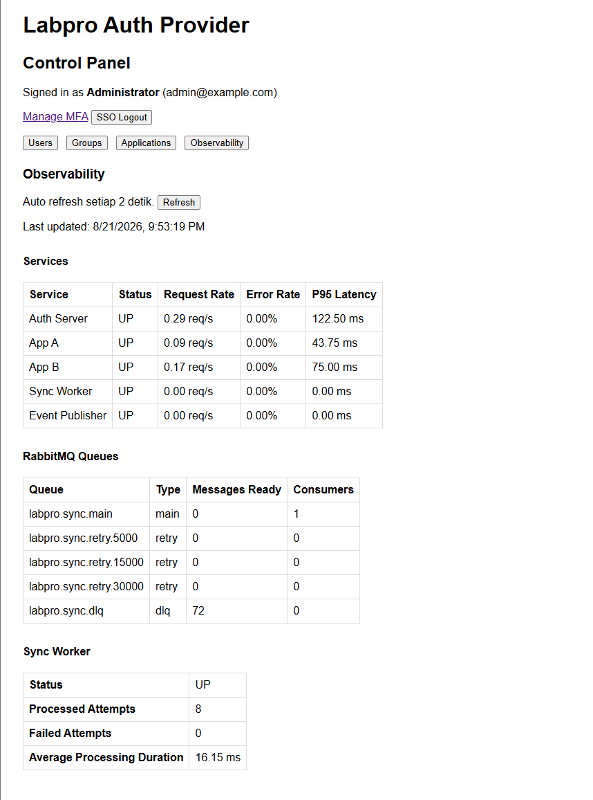
</p>

### 11. B02 — Sync Worker Down and Main Queue Backlog Increasing

<p align="center">
  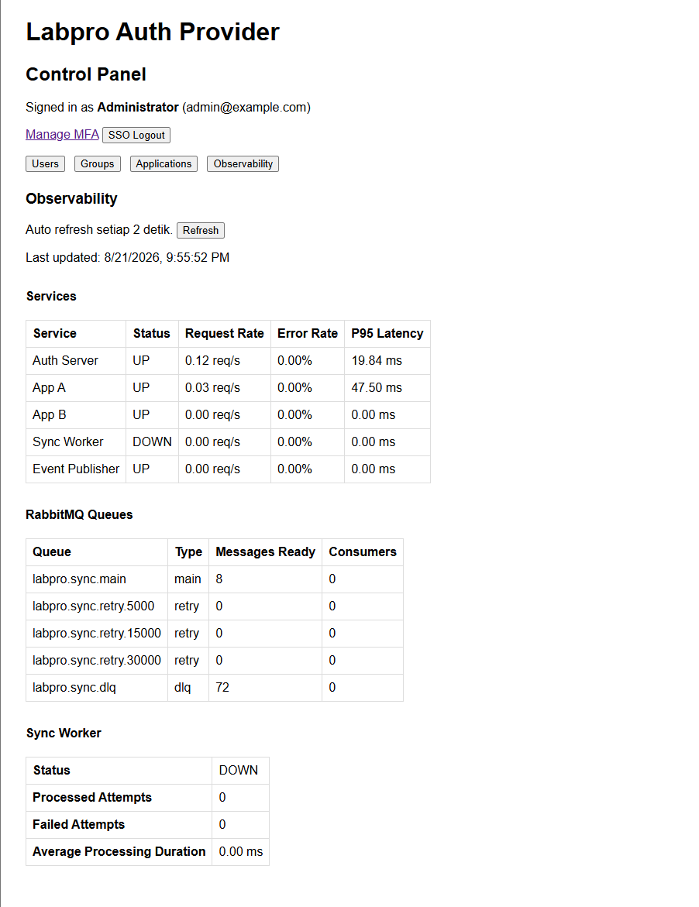
</p>

### 12. B02 — Sync Worker Recovered and Main Queue Drained

<p align="center">
  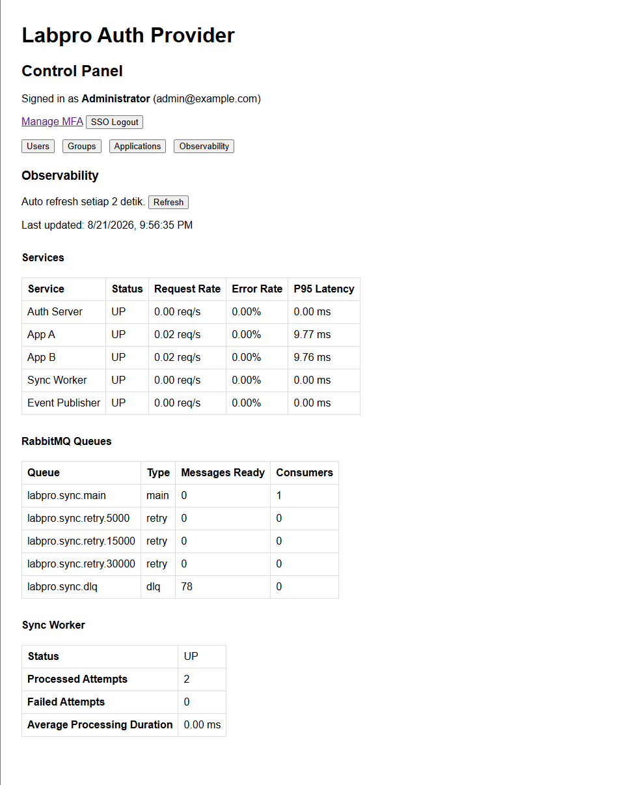
</p>

### 13. B03 — Primary Database Down: Liveness 200 and Readiness 503

<p align="center">
  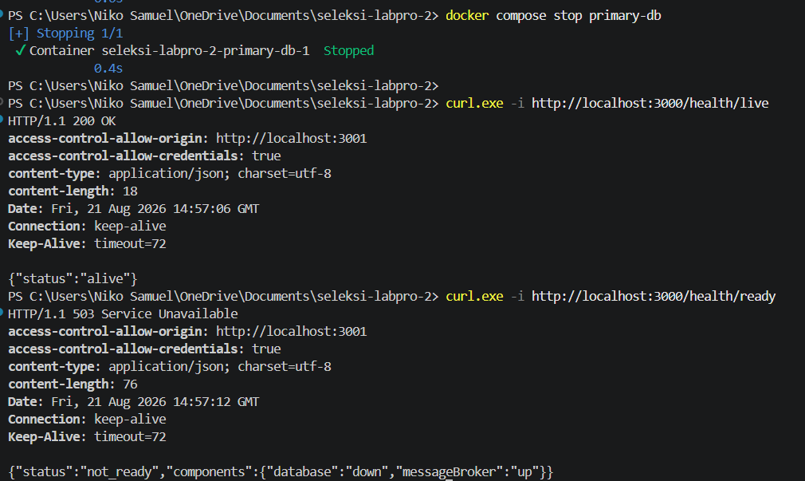
</p>

### 14. B03 — RabbitMQ Down: Liveness 200 and Readiness 503

<p align="center">
  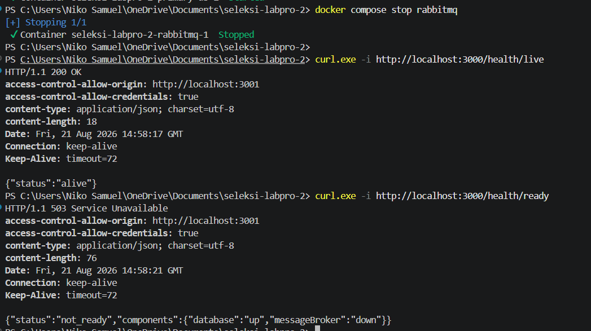
</p>

### 15. B03 — Readiness Recovery Without Auth Server Restart

<p align="center">
  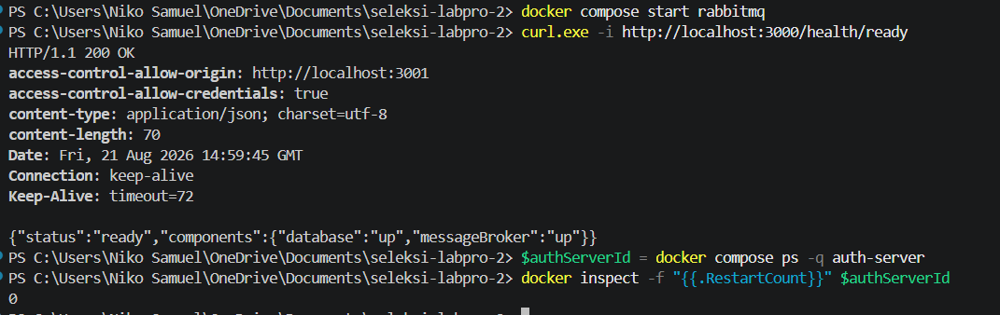
</p>

### 16. B04 — Sync Worker Graceful Shutdown on SIGTERM

<p align="center">
  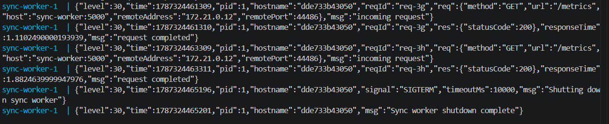
</p>
